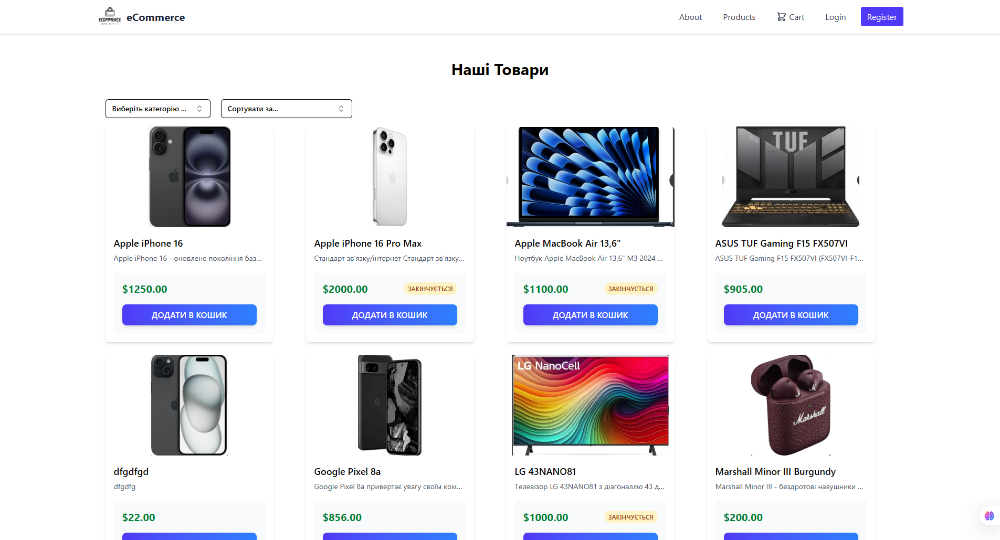
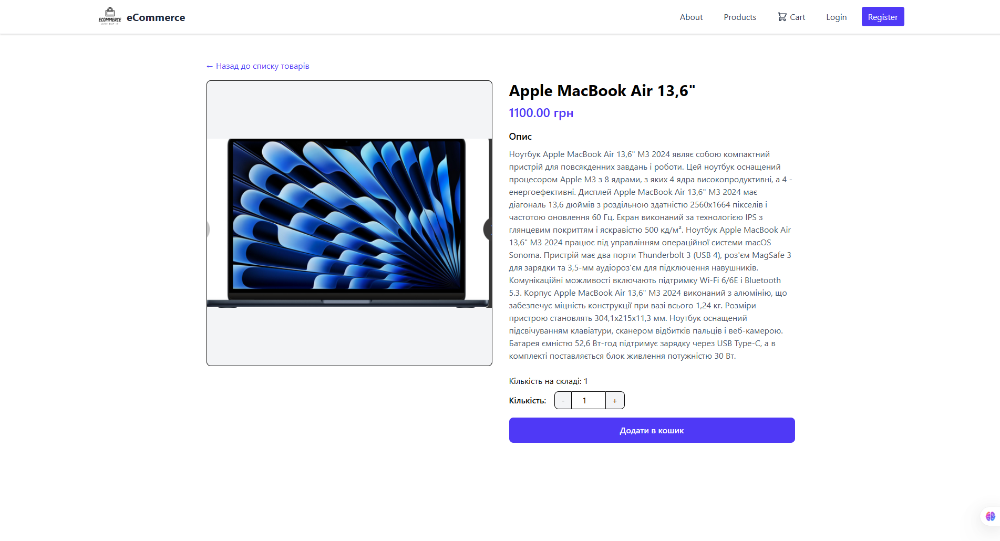
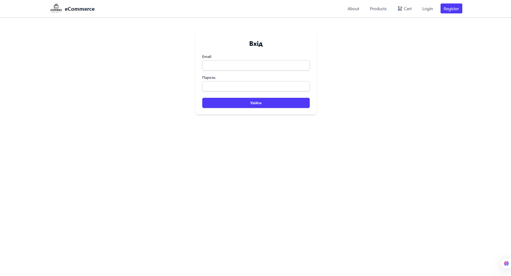

# eCommerce Project

A modern e-commerce web application built with [your technology stack].

## 📸 Screenshots

### Home Page


### Product Catalog



### Product Details



### Login Panel



## 🚀 Features

- **User Authentication & Authorization**

  - User registration and login
  - Password reset functionality
  - Role-based access control

- **Product Management**

  - Product catalog with search and filtering
  - Product categories and subcategories
  - Product reviews and ratings
  - Wishlist functionality

- **Shopping Experience**

  - Shopping cart management
  - Secure checkout process
  - Multiple payment methods
  - Order tracking

- **Admin Features**
  - Product management
  - Order management
  - User management
  - Analytics dashboard

## 🛠️ Technologies Used

- **Frontend**: [React/Vue/Angular]
- **Backend**: [Node.js/PHP/Python]
- **Database**: [MySQL/PostgreSQL/MongoDB]
- **Payment**: [Stripe/PayPal]
- **Authentication**: [JWT/OAuth]
- **Styling**: [CSS/Tailwind/Bootstrap]

## 📋 Prerequisites

- Node.js (v14 or higher)
- npm or yarn
- Database (MySQL/PostgreSQL/MongoDB)

## 🔧 Installation

1. Clone the repository:

```bash
git clone https://github.com/yourusername/ecommerce-project.git
cd ecommerce-project
```

2. Install dependencies:

```bash
npm install
```

3. Set up environment variables:

```bash
cp .env.example .env
```

4. Configure your database and other settings in `.env`

5. Run database migrations:

```bash
npm run migrate
```

6. Start the development server:

```bash
npm run dev
```

## 🚀 Usage

1. Open your browser and navigate to `http://localhost:3000`
2. Register a new account or use existing credentials
3. Browse products, add to cart, and proceed with checkout
4. Access admin panel at `/admin` (admin credentials required)

## 📁 Project Structure

```
eCommerce/
├── public/
│   └── uploads/
│       └── screenshots/
├── src/
│   ├── components/
│   ├── pages/
│   ├── hooks/
│   ├── services/
│   └── utils/
├── server/
│   ├── controllers/
│   ├── models/
│   ├── routes/
│   └── middleware/
└── README.md
```

## 🤝 Contributing

1. Fork the repository
2. Create your feature branch (`git checkout -b feature/AmazingFeature`)
3. Commit your changes (`git commit -m 'Add some AmazingFeature'`)
4. Push to the branch (`git push origin feature/AmazingFeature`)
5. Open a Pull Request

## 📝 License

This project is licensed under the MIT License - see the [LICENSE](LICENSE) file for details.

## 👨‍💻 Author

**Максим Рацілевич** - ВТ-23-1

## 🙏 Acknowledgments

- Thanks to all contributors
- Special thanks to university instructors
- Inspiration from modern e-commerce platforms
